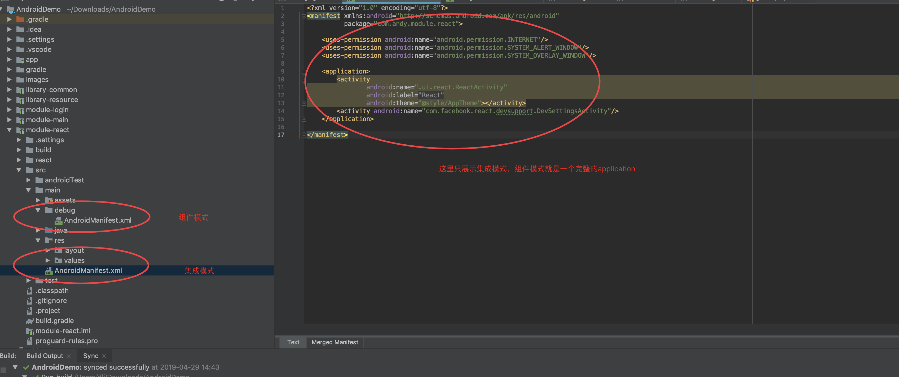
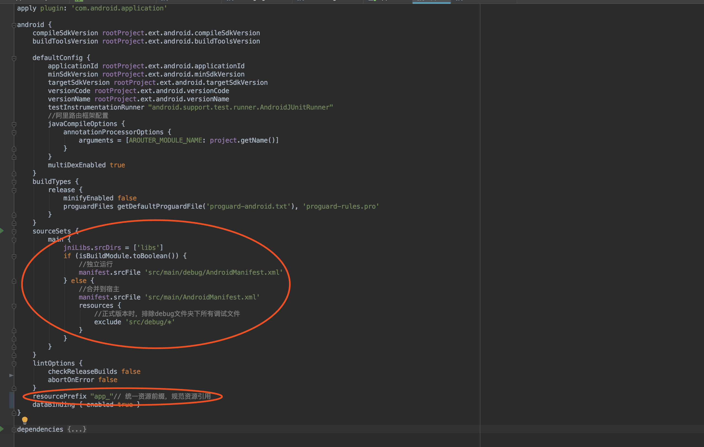

# Android组件化

  <table>
    <tr>
      <td></td>
    </tr>
    <tr>
      <td></td>
    </tr>
    <tr>
      <td></td>
    </tr>
    <tr>
      <td>	</td>
    </tr>
  </table>

<b>一、为什么要做组件化</b>
   随着业务的增长，越来越多的代码集成在同一个项目中。为了告别结构臃肿，让各个业务变得相对独立，业务组件在组件模式下可以独立开发，而在集成模式下变成arr包集成在一起，组成一个完整功能的APP。从组件化工程模型中可以看到，业务组件之间是独立的。这些组件在集成模式下是一个个library,被APP壳所依赖。在开发模式下，各个业务组件又是一个完整的APP，可以独立开发和调试。在组件开发模式下，业务组件的代码数量相比于集成模式来说少的很多，大大减少了编译的时间。

  

  上图是组件化工程模型，为了方便理解这张架构图，下面会列举一些组件化工程中用到的名词的含义：
  <table>
    <tr>
      <td>集成模式</td>
      <td>所有的业务组件被“app壳工程”依赖，组成一个完整的APP</td>
    </tr>
    <tr>
      <td>组件模式</td>
      <td>可以独立开发业务组件，每一个业务组件就是一个APP</td>
    </tr>
    <tr>
      <td>app壳工程	</td>
      <td>负责管理各个业务组件，和打包apk，指定APP启动页面、主界面</td>
    </tr>
    <tr>
      <td>业务组件</td>
      <td>根据公司具体业务而独立形成一个的工程</td>
    </tr>
    <tr>
      <td>功能组件</td>
      <td>提供开发APP的某些基础功能，例如打印日志、树状图等,支撑业务组件的基础，提供多数业务组件需要的功能，例如提供网络请求功能；</td>
    </tr>
    <tr>
      <td>资源组件</td>
      <td>将所需要的图片等资源放在这里</td>
    </tr>
  </table>

<b>二、组件化实施流程</b>
  <b>1）组件模式和集成模式的转换</b>
  Android Studio中的Module主要有两种属性，分别为：
    <b>application属性</b>，可以独立运行的Android程序，也就是我们的APP；
    apply plugin: ‘com.android.application’
    <b>library属性</b>，不可以独立运行，一般是Android程序依赖的库文件；
    apply plugin: ‘com.android.library’

  Gradle自动构建工具有一个重要属性，可以帮助我们完成这个事情。每当我们用AndroidStudio创建一个Android项目后，就会在项目的根目录中生成一个文件 gradle.properties，我们将使用这个文件的一个重要属性：在Android项目中的任何一个build.gradle文件中都可以把gradle.properties中的常量读取出来；那么我们在上面提到解决办法就有了实际行动的方法，首先我们在gradle.properties中定义一个常量值 isModule（是否是组件开发模式，true为是，false为否）：
    <b>
    ## 判断是否是DEBUG模式
    isBuildModule=false
    </b>
    
    if (isBuildModule.toBoolean()) {
        //作为独立App应用运行
        apply plugin: 'com.android.application'
    } else {
        //作为组件运行
        apply plugin: 'com.android.library'
    }

  <b>2）组件之间AndroidManifest合并问题</b>
    我们可以为组件开发模式下的业务组件再创建一个 AndroidManifest.xml，然后根据isModule指定AndroidManifest.xml的文件路径，让业务组件在集成模式和组件模式下使用不同的AndroidManifest.xml，这样表单冲突的问题就可以规避了。  

    sourceSets {
        main {
            if (isModule.toBoolean()) {
                manifest.srcFile 'src/main/debug/AndroidManifest.xml'
            } else {
                manifest.srcFile 'src/main/AndroidManifest.xml'
            }
        }
    }

  

 <b>3）gradle配置</b>
  版本控制：
  <b>在build.gradle中导入 apply from: 'versions.gradle'</b>
  版本控制的gradle
  
  主项目的：
  
  为了方便业务组件配置，单独配置两个模板：分别是【module.gradle】和【library.gradle】对应类库和业务组件，在这里就不展示

  <b>4）common和resource组件</b>
  resource组件：可以将所有的图片资源放在这里，便于控制
  common组件： 可以设置一些基本的设置，例如类的基本配置，应用的基本配置，跳转的路由的信息、网络的设置、API、工具类等等。

  <b>5）组件之间的调用和通信</b>
  这里有两个比较好的，分别是ActivityRouter和Router，我这里用的是Router。ActivityRouter和ARouter的接入组件化项目的方式是一样的，ActivityRouter提供的功能目前ARouter也全部支持，但是ARouter还支持依赖注入解耦，页面、拦截器、服务等组件均会自动注册到框架。对于大家来说，没有最好的只有最适合的，大家可以根据自己的项目选择合适的Router。
  1、首先在gradle中添加依赖

    // 组件中依赖阿里路由编译框架
    api rootProject.ext.dependencies["arouter-api"]

  2、这一步我们需要先了解 APT这个概念，APT(Annotation Processing Tool)是一种处理注解的工具，它对源代码文件进行检测找出其中的Annotation，使用Annotation进行额外的处理。 Annotation处理器在处理Annotation时可以根据源文件中的Annotation生成额外的源文件和其它的文件(文件具体内容由Annotation处理器的编写者决定)，APT还会编译生成的源文件和原来的源文件，将它们一起生成class文件。在这里我们将在每一个业务组件的 build.gradle 都引入ActivityRouter 的 Annotation处理器，我们将会在声明组件和Url的时候使用，annotationProcessor是Android官方提供的Annotation处理器插件，代码如下：

    annotationProcessor rootProject.ext.dependencies["arouter-compiler"]

  3、在主项目的gradle中配置defaultConfig

        //阿里路由框架配置
        javaCompileOptions {
            annotationProcessorOptions {
                arguments = [AROUTER_MODULE_NAME: project.getName()]
            }
        }

  4、在common组件中，编写跳转的组件，分为activity和fragment，

    /**
     * 登录组件
     */
    public static class Login {
        private static final String LOGIN = "/login";
        // 登录界面
        public static final String PAGER_LOGIN = LOGIN + "/Login";
    }

  5、activity页面添加注解
  
    @Route(path = RouterActivityPath.Main.PAGER_MAIN)
    public class MainActivity extends ActivityPresenter<MainDelegate>

  6、调用的地方

    Button react = findViewById(R.id.react);
    react.setOnClickListener(new View.OnClickListener() {
            @Override
            public void onClick(View v) {
                if (!isAllowed) {
                    return;
                }
                Bundle bundle = new Bundle();
                bundle.putString("react", "This is a demo for Home!!!!");
                navigation(RouterActivityPath.React.PAGER_REACT, bundle);
            }
    });

    private void navigation(String path, Bundle bundle) {
        ARouter.getInstance().build(path).with(bundle).navigation();
    }

  7、在Application中初始化
    
    @Override
    public void onCreate() {
        super.onCreate();
        initRouter();
    }

    /**
     * 初始化阿里路由框架
     */
    private void initRouter() {
        if (BuildConfig.DEBUG) {
            //一定要在ARouter.init之前调用openDebug
            ARouter.openDebug();
            ARouter.openLog();
        }
        ARouter.init(this);
    }

  <b>6）组件之间资源名冲突</b>
  因为我们拆分出了很多业务组件和功能组件，在把这些组件合并到“app壳工程”时候就有可能会出现资源名冲突问题，例如A组件和B组件都有一张叫做“ic_back”的图标，这时候在集成模式下打包APP就会编译出错，解决这个问题最简单的办法就是在项目中约定资源文件命名规约，比如强制使每个资源文件的名称以组件名开始，这个可以根据实际情况和开发人员制定规则。当然了万能的Gradle构建工具也提供了解决方法，通过在在组件的build.gradle中添加如下的代码：

    //设置了resourcePrefix值后，所有的资源名必须以指定的字符串做前缀，否则会报错。
    //但是resourcePrefix这个值只能限定xml里面的资源，并不能限定图片资源，所有图片资源仍然需要手动去修改资源名。
    resourcePrefix "girls_"

但是设置了这个属性后有个问题，所有的资源名必须以指定的字符串做前缀，否则会报错，而且resourcePrefix这个值只能限定xml里面的资源，并不能限定图片资源，所有图片资源仍然需要手动去修改资源名；所以我并不推荐使用这种方法来解决资源名冲突。

<b>三、业务组件架构</b>
关于什么是MVP，以及MVC、MVP、MVVM有什么区别，这类问题网上已经有很多的讲解，你可以自行搜索或看看文末的参考文章，这里就只讲讲为什么需要MVP。在Android开发中，Activity并不是一个标准的MVC模式中的Controller，它的首要职责是加载应用的布局和初始化用户界面，并接受并处理来自用户的操作请求，进而作出响应。但是，随着界面及其逻辑的复杂度不断提升，Activity类的职责不断增加，以致很容易变得庞大而臃肿。
越小的类，bug越不容易出现，越容易调试，更容易测试，我相信这一点大家是都赞同的。在MVP模式下，View和Model是完全分离没有任何直接关联的(比如你在View层中完全不需要导Model的包，也不应该去关联它们)。
使用MVP模式能够更方便的帮助Activity(或Fragment)职责分离，减小类体积，使项目结构更加清晰。

在github上有AndroidMVP，主要是需要定义一个View层接口，让View实现类Activity(Fragment)实现；其次需要定义一个Presenter实现接口，让Presenter实现类实现；
在View实现类Activity(Fragment)中包含Presenter对象，并在Presenter创建的时候传一个View对象；在Presenter中通过构造时传入的视图层对象操作View

<b>AndroidMVP存在的问题</b>
  1. 例如当应用进入后台且内存不足的时候，系统是会回收这个Activity的。通常我们都知道要用OnSaveInstanceState()去保存状态，用OnRestoreInstanceState()去恢复状态。 但是在我们的MVP中，View层是不应该去直接操作Model的，这样做不合理，同时也增大了M与V的耦合。
  2. 界面复用问题。通常我们在APP最初版本中是无法预料到以后会有什么变动的，例如我们最初使用一个Fragment去作为界面的显示，后来在版本变动中发现这个Fragment越来越庞大，而Fragment的生命周期又太过复杂造成很多难以理解的BUG，我们需要把这个界面放到一个Activity中实现。这时候就麻烦了，要把Fragment转成Activity，这可不仅仅是改改类名的问题，更多的是一大堆生命周期需要去修改。例如参考文章2中的译者就遇到过这样的问题。
  3. Activity本身就是Android中的一个Context。不论怎么去封装，都难以避免将业务逻辑代码写入到其中。

<b>解决现有方案的问题</b>
既然知道了这些问题，我们的解决办法自然是不要将Activity作为View层而去单独包含Presenter类进来。反过来，我们将Activity(Fragment)作为Presenter层的代码，包含一个View层的类来。如果你同时是一名IOS开发者，你一定会很熟悉，这不就是ViewController和APPDelegate吗。
使用Activity作为Presenter的优点就在于，可以原封不动的使用Activity本身的生命周期去处理项目逻辑，而不需要强加给另一个包含类，甚至记忆额外自定义的生命周期。
而同时作为独立的View层，我们的视图可以原封不动的传递给Presenter(不管是Activity或者Fragment)，而不需要改任何代码。对于一个开发团队，完全可以将View层的东西交给一个人编写，而将业务实现交给另一个人编写。而随着逻辑变化对View的更改，只需要通过Presenter层的包含一个代理对象————ViewDelegate来操作相应的更改方法就够了。

使用泛型解耦
现在我们是实现了View与Presenter的解耦，在onCreate中包含了一个接口对象来实现我们固定的一些必须方法。但是又引入了问题：一些特定方法没办法引用了。比如某个界面的设值、控件的修改显示逻辑对Presenter层的接口，接口对象必须强转成具体子类才能调用。解决办法：可以通过泛型来解决直接引用具体对象的问题。比如我们可以在子类定义以后确定一个Presenter中所引用的Delegate的具体类型。
 
    public abstract class ActivityPresenter<T extends IDelegate> extends Activity {
        protected T viewDelegate;

        protected void onCreate(Bundle savedInstanceState) {
            viewDelegate = getDelegateClass().newInstance();
        }

        protected abstract Class<T> getDelegateClass();
    }
这样我们在ActivityPresenter的继承类中就可以通过动态设置getDelegateClass()的返回值来确定Delegate的具体类型了。

利用变长数组构建View集合
由于Presenter在使用访问View的时候并不是直接调用，而是通过代理对象间接调用，如果我们在实现View层代码的时候有太多的控件需要被引用，可能就必须定义一大堆控件声明，会造成记忆负担。
这时候显然通过id去记忆更方便一些。我们可以使用SparseArray它是由两个数组来替代Map操作的类(如果你还是不知道他是干嘛的，可以简单的当成HashMap)。

结合上面的全部例子，可以为IDelegate接口定义一个抽象类，将全部的工具方法都集成进来

    public abstract class AppDelegate implements IDelegate {
        protected final SparseArray<View> mViews = new SparseArray<View>();

        protected View rootView;

        public abstract int getRootLayoutId();

        @Override
        public void create(LayoutInflater inflater, ViewGroup container, Bundle savedInstanceState) {
            int rootLayoutId = getRootLayoutId();
            rootView = inflater.inflate(rootLayoutId, container, false);
        }

        @Override
        public View getRootView() {
            return rootView;
        }

        public <T extends View> T bindView(int id) {
            T view = (T) mViews.get(id);
            if (view == null) {
                view = (T) rootView.findViewById(id);
                mViews.put(id, view);
            }
            return view;
        }

        public <T extends View> T get(int id) {
            return (T) bindView(id);
        }

        public void setOnClickListener(View.OnClickListener listener, int... ids) {
            if (ids == null) {
                return;
            }
            for (int id : ids) {
                get(id).setOnClickListener(listener);
            }
        }
    }

这里仅取一个简单的示例。首先是View层的实现

    public class SimpleDelegate extends AppDelegate {
        @Override
        public int getRootLayoutId() {
            return R.layout.delegate_simple;
        }

        @Override
        public void initWidget() {
            super.initWidget();
            TextView textView = get(R.id.text);
            textView.setText("在视图代理层创建布局");
        }

        public void setText(String text) {
            //get(id)等同于bindview(id)，从上文就可以看到了，get方法调用了bindview方法
            TextView textView = get(R.id.text);
            textView.setText(text);
        }
    }

接着是Presenter层的实现,在这里做业务逻辑操作，通过viewDelegate操作View层控件

      public class SimpleActivity extends   
      ActivityPresenter<SimpleDelegate> implements OnClickListener {

          @Override
          protected Class<SimpleDelegate> getDelegateClass() {
              return SimpleDelegate.class;
          }

          /**
          * 在这里写绑定事件监听相关方法
          */
          @Override
          protected void bindEvenListener() {
              super.bindEvenListener();
              viewDelegate.get(R.id.button1).setOnClickListener(this);
          }

          @Override
          public void onClick(View v) {
              switch (v.getId()) {
                  case R.id.button1:
                      viewDelegate.setText("你点击了button");
                      break;
              }
          }
      }

<b>四、集成React Native以及优化</b>
  1、自己新建一个rn项目，执行react-native init RNDemo
  2、将新建的文件里面除了iOS和Android以及node_modules，全部拷贝到组件中
    例如在【module-react】中新建文件夹【react】,将拷贝的文件放在里面
  3、在react文件夹中执行【yarn/npm install】
  4、加载依赖
     api rootProject.ext.dependencies["react-native"]
  5、配置主项目的build.gradle
     在allprojects的repositories添加一条（根据自己项目的划分来设置）
     maven { url "$rootDir/module-react/react/node_modules/react-native/android" }
  6、为了防止个别机型.so库和findbugsbug问题，建议在组件的build.gradle中增加下面的代码：

    android {
      defaultConfig {
        ndk {
            //选择要添加的对应cpu类型的.so库。
            abiFilters 'armeabi', "armeabi-v7a","armeabi-v7a","x86"
        }
      }
    
      configurations.all {
          resolutionStrategy.force 'com.google.code.findbugs:jsr305:3.0.0'
      }

      。。。
    }

  7、AndroidManifest.xml（添加权限和设置debug模式Activity）
  添加权限：

    <uses-permission android:name="android.permission.INTERNET"/>
    /**设置调试 的权限**/
    <uses-permission android:name="android.permission.SYSTEM_ALERT_WINDOW"/>
    <uses-permission android:name="android.permission.SYSTEM_OVERLAY_WINDOW" />

    <activity
      android:name=".ReactActivity"
      android:theme="@style/Theme.AppCompat.Light.NoActionBar">
    </activity>

                                                        
  添加debug模式Activity(正式打包注释掉就好了)，debug模式下需要悬浮窗的权限，这个需要手动设置，每部手机姿势不一样，具体请百度调整姿势。如果没有设置的话，个别手机在debug模式下reload会出现异常

    <activityandroid:name="com.facebook.react.devsupport.DevSettingsActivity"/>
  
  8、新建一个Activity，继承BaseReactActivity，新建一个ReactActivityHelper用于控制界面信息。ReactActivityHelper里面主要有ReactInstanceManager和ReactRootView
  在主项目中Application中调用，加快运行速度，防止白屏

    public void initReact(Application application) {
        if (mReactInstanceManager == null) {
            mReactInstanceManager = ReactInstanceManager.builder()
                    .setApplication(application)
                    .setBundleAssetName("index.android.bundle")
                    .setJSMainModulePath("index")
                    .addPackage(new MainReactPackage())
                    .setUseDeveloperSupport(BaseApplication.isDebug())
                    .setInitialLifecycleState(LifecycleState.BEFORE_CREATE)
                    .build();
            mReactInstanceManager.createReactContextInBackground();
        }
    }
  
  在BaseReactActivity中调用这个方法的，setContentView设置获取的View

    protected ReactRootView getContentView(Context context) {
        ReactRootView mReactRootView = new ReactRootView(context);
        //这里的AndroidRnDemoApp必须对应“index.js”中的“AppRegistry.registerComponent()”的第一个参数
        mReactRootView.startReactApplication(mReactInstanceManager, COMPONENT_NAME, null);
        return mReactRootView;
    }

  9、首先在项目app/src/main下面必须要创建一个assets目录，然后我们就开始打离线包啦：（根据自己的文件夹位置来设置）

    react-native bundle --platform android --dev false --entry-file index.js --bundle-output ../src/main/assets/index.android.bundle --assets-dest ../src/main/res/

<b>五、APP问题和性能优化</b>
  1、我们在library模式下调用BuildConfig.DEBUG,获取到的永远都是false
     首先是在common组件中设置一个BaseApplication，主项目Application继承BaseApplication，获取变量debug,将主项目中的BuildConfig.DEBUG赋值于debug。其他的地方继承了common组件，就可以用BaseApplication.isDebug()获取到
  2、阿里矢量图来设置组件信息，将ttf为类型的文件copy到asstes中，然后写一个组件，组件继承TextView,在初始化中设置字体类型即可（仅限Android4.4以上的系统）
  3、React Native白屏优化和性能优化

  <b>。。。。。未完待续</b>

